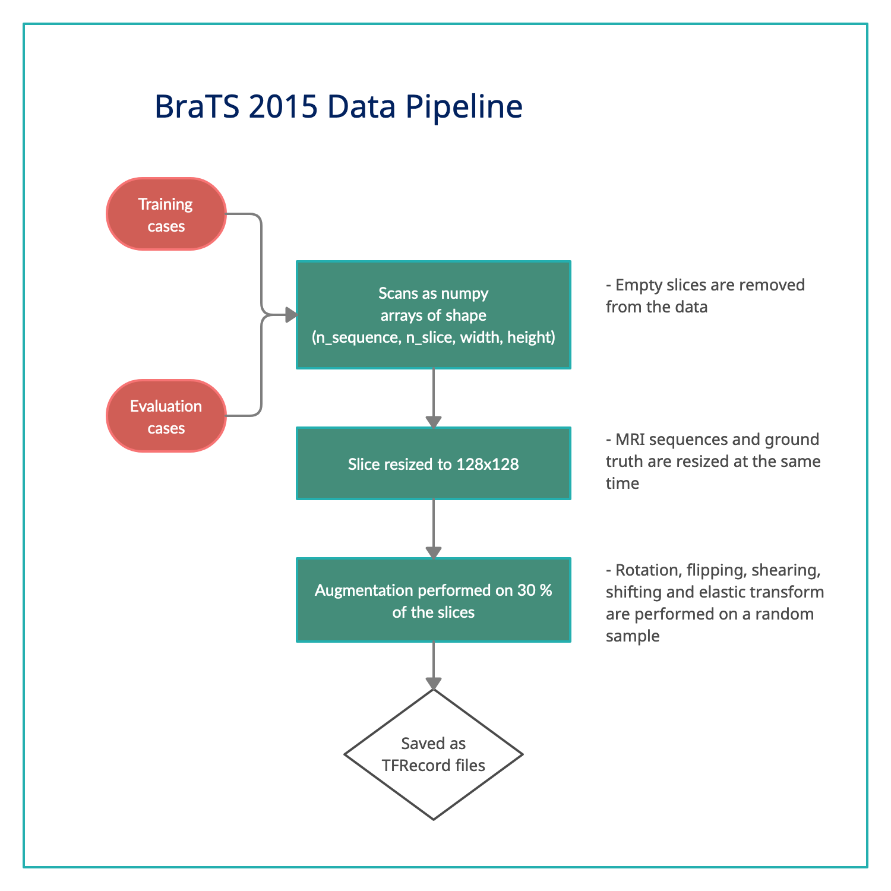

# Moving Medical Image Analysis to GPU Embedded Systems: Application to Brain Tumor Segmentation - Data Pipeline

This repository holds the data pipeline used for the experiments carried in [[1]](#1).

The training set includes 220 cases of high-grade glioma (HGG) and 54 cases of low-grade glioma (LGG). For each case, four sequences are available: Flair, T2, T1, and T1 c. Each brain in the set also comes with a ground truth image containing 5 labels. The pipeline extracts all 4 sequences and build an augmented dataset for image segmentation purposes. The pipeline used can be seen in the following figure : 

 

## Run Script

Before running the pipeline to create the dataset as tfrecord files, you must have the BraTS 2015 dataset in its original form (containing the HGG and LGG folders). The creation of the data will also re-organize this folder to have three new folders namely 'training', 'validation' and 'testing'. These folders contain 70%, 20% and 10% of the dataset respectively.

To run the script :

<pre>python make_training_data.py</pre>

You'll then be asked to enter the path to the BraTS 2015 dataset and a folder name to save the tfrecords to.

## References
<a id="1">[1]</a> 
 Brad Niepceron, Ahmed Nait-Sidi-Moh & Filippo Grassia (2020) 
 Moving Medical Image Analysis to GPU Embedded Systems: Application to Brain Tumor Segmentation, Applied Artificial Intelligence,
 34:12, 866-879, DOI: 10.1080/08839514.2020.1787678
